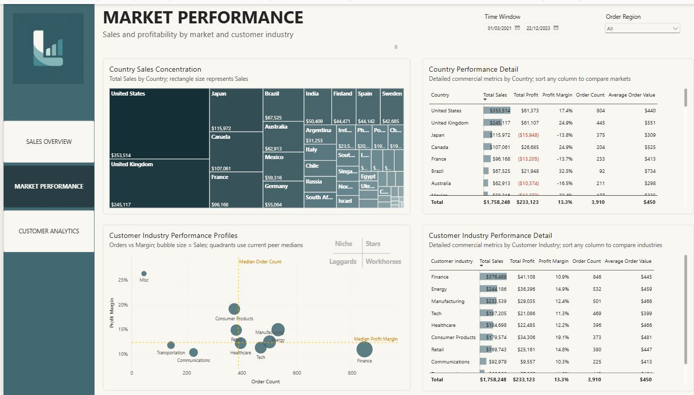
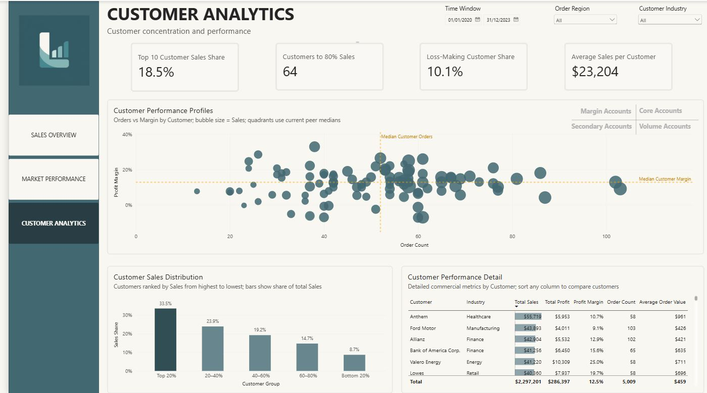

# SaaS Sales Performance Dashboard

An end-to-end Power BI analytics project that transforms a flat SaaS sales dataset into a validated star-schema semantic model and an interactive three-page dashboard.

Built with Power Query, DAX, Field Parameters, and controlled visual interactions to analyze performance drivers, market quality, and customer portfolio health.

> **Live dashboard:** [View the interactive Power BI report](https://app.powerbi.com/view?r=eyJrIjoiNGI3MTlkZWItNjE1OS00MGYyLWFlOWUtYWQwMDZjOGU0NWZhIiwidCI6IjU3Mzk3N2E3LTk3NTEtNGMwOS1hZTc3LTg0NzI3MGM1Mjc1OCIsImMiOjEwfQ%3D%3D)

> **Data Preparation and Modeling:** See [`docs/data-preparation-and-modeling.md`](`docs/data-preparation-and-modeling.md`)

> **Star-Schema Model:** See [`visuals/star-schema-model.PNG`](`visuals/star-schema-model.PNG`)


## Project Overview

This project analyzes a SaaS sales dataset to answer three connected business questions:

1. How is the business performing overall, and what is driving growth?
2. Which markets and customer industries are contributing strong or weak commercial performance?
3. How concentrated and healthy is the customer portfolio?

The final report contains three pages: **Sales Overview**, **Market Performance**, and **Customer Analytics**.

## Dashboard Purpose & Users

**Primary users:** Commercial manager or sales manager who need to review overall performance, market quality, and customer portfolio health.

**Decision support:** The dashboard helps users:
- understand whether Sales growth is driven by more Orders or higher AOV;
- assess whether Profit growth is supported by Sales growth or stronger Profit Margin;
- identify strong and weak Countries / Customer Industries for further investigation;
- monitor customer concentration and loss-making customer exposure;
- identify Customers or markets that may require follow-up.

**Data usage:** The dashboard supports analysis over a user-selected time window and reflects the latest source data available at the most recent dataset refresh.

## Core KPI Definitions

| KPI | Definition |
|---|---|
| **Sales** | Sum of source-defined Sales in the selected context |
| **Profit** | Sum of source-defined Profit |
| **Profit Margin** | Profit / Sales |
| **Order Count** | Distinct count of Order ID |
| **Average Order Value** | Sales / Order Count |

> Detailed definitions, analytical metrics, assumptions, and limitations are documented in [`docs/metric-definitions.md`](docs/metric-definitions.md).


## Dataset

The source dataset contains:

- **9,994** sales transaction lines
- **5,009** unique orders
- **99** customers
- **48** countries
- **10** customer industries
- Order dates from **2020 to 2023**

One row represents one sales transaction line within an order.

> **Data source:** [Original public dataset link](https://www.kaggle.com/datasets/nnthanh101/aws-saas-sales?select=SaaS-Sales.csv).  
> **Data dictionary:** See [`docs/data-dictionary.md`](`docs/data-dictionary.md`)

## Report Structure

```text
SALES OVERVIEW
├── Financial Health
├── Profit Growth Drivers
├── Sales Growth Drivers
└── Top Contributors

MARKET PERFORMANCE
├── Geographic Sales Concentration
├── Customer Industry Profiling
└── Detailed Market Performance Comparison

CUSTOMER ANALYTICS
├── Customer Concentration Risk
├── Unprofitable Customer Exposure
├── Customer Portfolio Profiling
└── Detailed Customer Performance Comparison
```

## Dashboard Story

### PAGE 1. Sales Overview

**Purpose:** Establish the overall financial picture and identify the main drivers of performance.


- **Financial Health:** 
tracks Sales, Profit, Profit Margin, Order Count, and Average Order Value (AOV). KPI cards compare the selected period with the same period in the prior year so that growth in commercial scale can be assessed alongside profitability.

- **Profit Growth Drivers:** Profit growth is examined through Sales and Profit Margin to distinguish growth supported by higher Sales from growth supported by stronger profitability, and to identify periods where Sales growth may be offset by Margin compression.

- **Sales Growth Drivers:** Sales growth is examined through Order Count and Average Order Value to distinguish growth supported by higher order volume from growth supported by higher value per order.

- **Top Contributors:** Dynamic Top 5 views identify the **Countries** and **Customers** contributing the most **Sales or Profit** in the selected business context.

> **Dual-axis interpretation note:** Both Profit Growth Drivers and Sales Growth Drivers use charts with independently
> auto-scaled secondary Y-axes to preserve the readability of each metric over time.
> Because the two series use different units and scales, their visual
> alignment may suggest a stronger relationship than actually exists.
> Similar movements should therefore not be interpreted as evidence of
> correlation or causation without further analysis.
---

### PAGE 2. Market Performance

**Purpose:** Compare geographic and customer-industry performance beyond Sales alone.



- **Geographic Sales Concentration:** A treemap shows where Sales are concentrated across Countries.

- **Customer Industry Profiling:** Customer industries are categorized based on order volume and profit margin, with sales represented by bubble size. The relative profiles are interpreted as:

| Group          | Business interpretation                               | Business use                                                                                                          |
| -------------- | ----------------------------------------------------- | --------------------------------------------------------------------------------------------------------------------- |
| **Stars**      | Higher Order volume + higher Margin relative to peers | Core industries with strong demand and profitability; candidates for resource prioritization and expansion            |
| **Niche**      | Lower Order volume + higher Margin                    | Strong profitability but lower buying frequency/volume; assess opportunities to expand volume while protecting Margin |
| **Workhorses** | Higher Order volume + lower Margin                    | Important volume drivers, but commercial economics deserve review before making adjustments                           |
| **Laggards**   | Lower Order volume + lower Margin                     | Weaker relative profile; investigate root causes before deciding whether/how strategy should change                   |

- **Detailed Market Comparison:** Country and Industry detail tables provide exact commercial metrics so patterns observed in the treemap and scatter plot can be validated and compared precisely.

---

### PAGE 3. Customer Analytics

**Purpose:** Assess customer concentration, profitability exposure, and portfolio quality.



- **Customer Concentration Risk:** evaluates dependence on large customers using: Top 10 Customer Sales Share, Customers to 80% Sales, Customer Sales Distribution by quintile

- **Unprofitable Customer Exposure:** measured by Loss-Making Customer Share - the percentage of customers whose total Profit is below zero in the current analysis context.

- **Customer Portfolio Profiling:** Customers are categorized into Core, Margin, Volume, and Secondary accounts based on order volume and profit margin, with sales scale represented by bubble size. The relative profiles are interpreted as:

| Group                  | Meaning                       | Business use                                                                                                                 |
| ---------------------- | ----------------------------- | ---------------------------------------------------------------------------------------------------------------------------- |
| **Core Accounts**      | Higher Orders + higher Margin | Strong relationships on both activity and profitability; protect and prioritize, while assessing sustainable expansion       |
| **Margin Accounts**    | Lower Orders + higher Margin  | Profitable relationships with lower buying volume; assess buying-frequency and expansion opportunities                            |
| **Volume Accounts**    | Higher Orders + lower Margin  | Important volume contributors but weaker profitability; review commercial economics before changing pricing/service approach |
| **Secondary Accounts** | Lower Orders + lower Margin   | Weaker relative profile; investigate why before deciding the appropriate account strategy                

- **Detailed Customer Comparison**: The Customer Performance Detail table provides exact **Sales, Profit, Profit Margin, Order Count, and AOV** for account-level comparison and investigation.

## Selected Analytical Methods
This section highlights analytical methods whose logic or interpretation
benefits from additional explanation. Metric definitions are documented
separately in `docs/metric-definitions.md`.

### 1. Current-Context Peer Benchmarking

Used in the Industry and Customer Performance Profiles.

Median Order Count and Median Profit Margin are recalculated within the
current filter context. The resulting quadrants therefore describe relative
performance versus the currently selected peer group rather than fixed
business classifications.

### 2. Cumulative Sales Threshold

Used for Customers to 80% Sales.

Customers are ranked by Sales from highest to lowest and accumulated until
their combined Sales reach at least 80% of Total Sales. The result shows the
minimum number of customers required to reach that threshold.

### 3. Dynamic Customer Quintile Segmentation

Customers are ranked by Sales within the current filter context and divided
into five similarly sized groups. Sales Share is then calculated for each
group to show how Sales are distributed across the customer base.

## Tools
- **Power BI Desktop** — data modeling, DAX, report development, and visualization
- **Power Query** — data preparation
- **GitHub** — portfolio documentation and project versioning