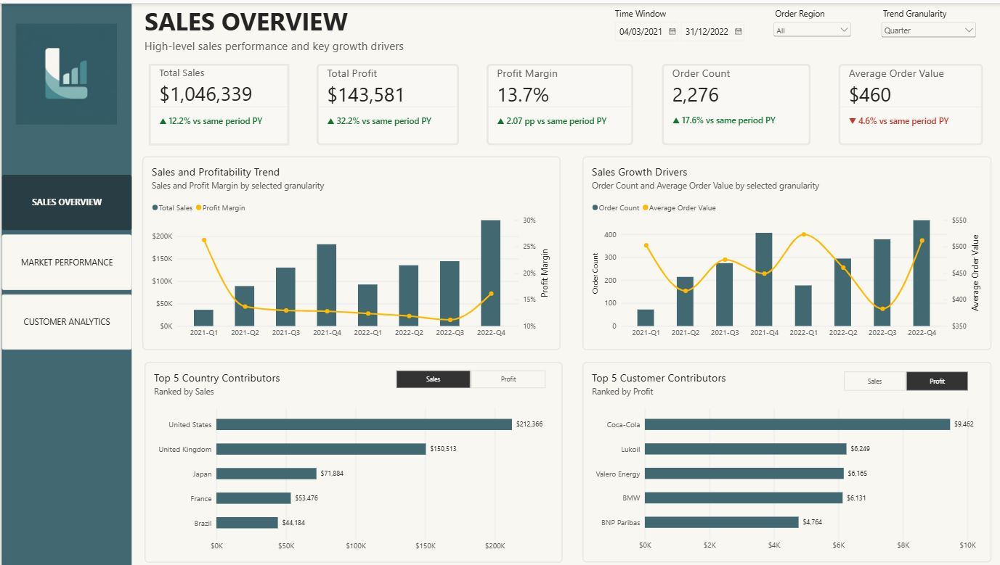

# SaaS Sales Performance Dashboard

From business performance to account-level risk — a Power BI dashboard for diagnosing growth drivers, market quality, and customer portfolio health.

> **Live dashboard:** [View the interactive Power BI report](https://app.powerbi.com/view?r=eyJrIjoiNGI3MTlkZWItNjE1OS00MGYyLWFlOWUtYWQwMDZjOGU0NWZhIiwidCI6IjU3Mzk3N2E3LTk3NTEtNGMwOS1hZTc3LTg0NzI3MGM1Mjc1OCIsImMiOjEwfQ%3D%3D)

## Project Overview

This project analyzes a SaaS sales dataset to answer three connected business questions:

1. How is the business performing overall, and what is driving growth?
2. Which markets and customer industries are contributing strong or weak commercial performance?
3. How concentrated and healthy is the customer portfolio?

The final report contains three pages: **Sales Overview**, **Market Performance**, and **Customer Analytics**.

## Report Structure

```text
SALES OVERVIEW
├── Financial Health
├── Profit Performance Drivers
├── Growth Drivers
└── Top Contributors

MARKET PERFORMANCE
├── Geographic Sales Concentration
├── Customer Industry Profiling
└── Detailed Market Performance Comparison

CUSTOMER ANALYTICS
├── Customer Concentration Risk
├── Unprofitable Customer Exposure
├── Customer Portfolio Profiling
└── Detailed Customer Performance Comparison
```

## Tools
- **Power BI Desktop** — data modeling, DAX, report development, and visualization
- **Power Query** — data preparation
- **GitHub** — portfolio documentation and project versioning

## Dataset

The source dataset contains:

- **9,994** sales transaction lines
- **5,009** unique orders
- **99** customers
- **48** countries
- **10** customer industries
- Order dates from **2020 to 2023**

One row represents one sales transaction line within an order.

Core fields used in the analysis include **Order Date, Region, Country, Customer, Customer Industry, Sales, Profit, Quantity, Discount, Order ID, and License**.

> **Data source:** [Original public dataset link](https://www.kaggle.com/datasets/nnthanh101/aws-saas-sales?select=SaaS-Sales.csv).  
> **Data dictionary:** See `docs/data-dictionary.md`.

## Dashboard Story

### PAGE 1. Sales Overview

**Purpose:** Establish the overall financial picture and identify the main drivers of performance.



- **Financial Health:** 
tracks Sales, Profit, Profit Margin, Order Count, and Average Order Value (AOV). KPI cards compare the selected period with the same period in the prior year so that growth in commercial scale can be assessed alongside profitability.

- **Profit Performance Drivers:** Profit performance is assessed through Sales and Profit Margin to distinguish improvement supported by greater business scale from improvement driven by stronger profitability, and to identify periods where Sales growth may be offset by Margin compression.

- **Growth Drivers:** Sales growth is decomposed through **Order Count** and **Average Order Value** to distinguish growth driven by higher order volume from growth driven by higher value per order.

- **Top Contributors:** Dynamic Top 5 views identify the **Countries** and **Customers** contributing the most **Sales or Profit** in the selected business context.

---

### PAGE 2. Market Performance

**Purpose:** Compare geographic and customer-industry performance beyond Sales alone.


- **Geographic Sales Concentration:** A treemap shows where Sales are concentrated across Countries. The accompanying Country Performance Detail table adds **Profit, Profit Margin, Order Count, and AOV**, allowing high-Sales markets to be checked for broader commercial health.

- **Customer Industry Profiling:** Customer industries are categorized based on order volume and profit margin, with sales represented by bubble size. The relative profiles are interpreted as:

| Group          | Business interpretation                               | Business use                                                                                                          |
| -------------- | ----------------------------------------------------- | --------------------------------------------------------------------------------------------------------------------- |
| **Stars**      | Higher Order volume + higher Margin relative to peers | Core industries with strong demand and profitability; candidates for resource prioritization and expansion            |
| **Niche**      | Lower Order volume + higher Margin                    | Strong profitability but lower buying frequency/volume; assess opportunities to expand volume while protecting Margin |
| **Workhorses** | Higher Order volume + lower Margin                    | Important volume drivers, but commercial economics deserve review before making adjustments                           |
| **Laggards**   | Lower Order volume + lower Margin                     | Weaker relative profile; investigate root causes before deciding whether/how strategy should change                   |

- **Detailed Market Comparison:** Country and Industry detail tables provide exact commercial metrics so patterns observed in the treemap and scatter plot can be validated and compared precisely.

---

### PAGE 3. Customer Analytics

**Purpose:** Assess customer concentration, profitability exposure, and portfolio quality.


- **Customer Concentration Risk:** evaluates dependence on large customers using: Top 10 Customer Sales Share, Customers to 80% Sales, Customer Sales Distribution by quintile

- **Unprofitable Customer Exposure:** measured by Loss-Making Customer Share - the percentage of customers whose total Profit is below zero in the current analysis context.

- **Customer Portfolio Profiling:** Customers are categorized into Core, Margin, Volume, and Secondary accounts based on order volume and profit margin, with sales scale represented by bubble size. The relative profiles are interpreted as:

| Group                  | Meaning                       | Business use                                                                                                                 |
| ---------------------- | ----------------------------- | ---------------------------------------------------------------------------------------------------------------------------- |
| **Core Accounts**      | Higher Orders + higher Margin | Strong relationships on both activity and profitability; protect and prioritize, while assessing sustainable expansion       |
| **Margin Accounts**    | Lower Orders + higher Margin  | Profitable relationships with lower buying volume; assess buying-frequency and expansion opportunities                            |
| **Volume Accounts**    | Higher Orders + lower Margin  | Important volume contributors but weaker profitability; review commercial economics before changing pricing/service approach |
| **Secondary Accounts** | Lower Orders + lower Margin   | Weaker relative profile; investigate why before deciding the appropriate account strategy                

- **Detailed Customer Comparison**: The Customer Performance Detail table provides exact **Sales, Profit, Profit Margin, Order Count, and AOV** for account-level comparison and investigation.

## Selected Analytical Methods
This section documents selected analytical methods whose underlying calculation or interpretation is not immediately obvious from the dashboard. It focuses only on methods that benefit from additional explanation rather than providing an exhaustive list of report measures.

### 1. Industry & Customer Performance Profiles visuals — Current-Context Peer Benchmarking (Pages 2–3)
The scatter-plot quadrants are **relative profiles**, not fixed business classifications. Median Order Count and Median Profit Margin are recalculated within the current peer context, so a profile describes an entity relative to the currently selected population.

### 2. Top 10 Customer Sales Share card - Customer Concentration Measure (Page 3)
Calculate the percentage of total revenue contributed by top 10 customers

### 3. Customers to 80% Sales visual - Cumulative Sales Threshold method (Page 3)
Customers are ranked by Sales from highest to lowest and accumulated until their combined Sales reach at least 80% of Total Sales. The measure returns the minimum number of customers required to reach that threshold.

### 4. Loss-Making Customer Share card - Profitability Exposure Measure (Page 3)
Calculate the percentage of customers whose total Profit is below zero in the current analysis context.

### 5. Customer Sales Distribution visual - Dynamic Customer Quintile Segmentation method (Page 3)
Customers are ranked by Sales within the current filter context and divided into five similarly sized groups to measure how much of Total Sales each 20% customer group contributes.

Conceptually:

```text
Current filter context
        ↓
Calculate Sales by customer
        ↓
Rank customers by Sales, highest to lowest
        ↓
Split customers into five groups
        ↓
Sum Sales within each group
        ↓
Sales Share = Group Sales / Total Sales
```
